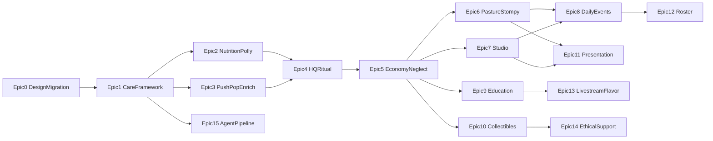

# Alveus Sanctuary Keeping — Grand Roadmap

> **Status:** Living epic backlog · **Audience:** humans + planning agents  
> **Role:** High-level source of truth for *what to build next* and lore corrections.  
> **Numbers:** [`crates/alveus-configs`](crates/alveus-configs) (Rust shipped + README Planned ballparks).  
> **Prose sketches:** [`design/`](design/) markdown only — not contracts. [`concept.md`](concept.md) is historical.

---

## North Star

**Alveus Sanctuary Keeping** is a cozy, low-stress daily management game where players are sanctuary staff caring for real Alveus animal ambassadors.

| Pillar | Meaning |
|--------|---------|
| **A cozy ritual** | ~10-minute daily check-ins. Consistency over grind. |
| **Authentic Alveus** | Lore, chores, and collectibles inspired by the real sanctuary founded by Maya Higa — fall in love with an individual ambassador, then care about their species. |
| **Compassionate care** | Animals never die, get sick, or face harm in play. Neglect only dirties, hungers, or bores — and freezes progress until care resumes. |
| **Zero dark patterns** | No energy caps, gacha, predatory timers, or pay-to-win. Optional support mirrors real nonprofit giving. |
| **Agent-native** | Drive the game like a player via `GameCommand` + ECS queries (BRP). No bespoke agent API; the ECS *is* the API. See [`AGENTS.md`](AGENTS.md). |

**Real-world mission (context for design):** Alveus is a nonprofit wildlife sanctuary and *virtual* education center (Austin, TX; not open to the public). Education happens online — 24/7 Twitch cams, Animal Quest, creator collaborations, and the emerging Alveus Research & Recovery Institute. The game should feel like *being on staff for a day*, not like visiting a zoo.

---

## Where we are (runtime)

A solid **vertical slice** exists today:

- Overview map locomotion, collision, entrances, camera, toast.
- Enterable interiors: **Nutrition House**, **Push Pop Enclosure**.
- Stats (hunger / happiness / cleanliness), decay, upkeep, neglect *banner*, autosave.
- Push Pop **feed** (fridge → satchel → dish) + **poop / wheelbarrow / compost** cleaning loop.
- HUD, splash/title/menus, headless BRP + Python drivers + Rust tests.

Still mostly design-only or stubbed: Pasture, Studio, HQ; Polly in-room care; prep/fridge menus; enrichment; economy/coins; daily events; education; sprites/audio; satchel still 1 slot; only two `ItemId`s in code.

**Implement next:** **Epic 1**. Without a general care-interaction framework, every later room stays stuck on the Push Pop give/feed pattern.

---

## How to use this file

1. Pick an epic below (respect **Depends on**).
2. Hand the whole `## Epic N: …` section to another agent as the planning brief.
3. That agent produces an implementation plan (and later code) against *current* repo truth — re-read code and [`alveus-configs`](crates/alveus-configs); do not trust stale coords in old markdown sketches.
4. When an epic ships, tick it here and note any lore/mechanic deltas that supersede older design docs.

### Lore correction (bake into Studio+)

| Topic | Old design (removed JSON) | Roadmap truth |
|-------|---------------------------|---------------|
| **Siren** | Ball python + shed/mist tank | Real Siren was a **Blue-fronted Amazon** parrot (`Amazona aestiva`). She passed in January 2026. Honor her as memorial / legacy ambassador; parrot care & enrichment, not snake shed. |
| **Snake shed day** | Tied to Siren | Move to a later snake ambassador (**Noodle** / **Patchy**) in Epic 12. |

---

## Epic index

| # | Epic | Phase |
|---|------|-------|
| [0](#epic-0-design-system-migration) | Design System Migration | Foundation |
| [1](#epic-1-care-interaction-framework) | Care Interaction Framework | Core loop |
| [2](#epic-2-nutrition-house-complete-polly--prep) | Nutrition House Complete (Polly + prep) | Core loop |
| [3](#epic-3-push-pop-enrichment--polish) | Push Pop Enrichment & Polish | Core loop |
| [4](#epic-4-hq-office--daily-ritual) | HQ Office & Daily Ritual | Meta spine |
| [5](#epic-5-passive-economy--neglect-atmosphere) | Passive Economy & Neglect Atmosphere | Meta spine |
| [6](#epic-6-pasture--stompy) | Pasture & Stompy | Sanctuary expand |
| [7](#epic-7-studio-georgie--siren-parrot) | Studio: Georgie + Siren (parrot) | Sanctuary expand |
| [8](#epic-8-daily-events-system) | Daily Events System | Variety |
| [9](#epic-9-education--animal-quest) | Education & Animal Quest | Mission |
| [10](#epic-10-collectibles-caretakers-cosmetics) | Collectibles, Caretakers, Cosmetics | Progression |
| [11](#epic-11-presentation-pass-spritesaudiovfx) | Presentation Pass (sprites/audio/VFX) | Feel |
| [12](#epic-12-ambassador-roster-expansion) | Ambassador Roster Expansion | Scale |
| [13](#epic-13-livestream-sanctuary-flavor) | Livestream Sanctuary Flavor | Alveus identity |
| [14](#epic-14-ethical-support--outreach) | Ethical Support & Outreach | Non-profit |
| [15](#epic-15-agent-native-hardening--content-pipeline) | Agent-Native Hardening & Content Pipeline | Platform |

---

## Epic 0: Design System Migration

**Status:** Shipped.

**Goal:** Make this roadmap (and a thin successor concept process) the design SoT; put all gameplay numbers in `alveus-configs`; make `design/` markdown-only.

**Why now:** Agents and humans need one place that says what ships next and what lore is current, and one place for numbers — not a JSON-schema folder pretending to be a contract.

**Player fantasy:** N/A (process epic).

**Scope:**
- Establish `ROADMAP.md` as the epic backlog (this file).
- Point README / AGENTS / `design/README.md` at the three-layer SoT; `design/` is historical markdown inspiration.
- Lightweight concept process: epic briefs here + optional `docs/concepts/*.md` — no mega-schema.
- Capture lore deltas (Siren parrot memorial; snake shed deferred).
- Migrate hardcoded gameplay magic into `alveus-configs` Rust; curate unshipped ballparks in `alveus-configs/README.md`.
- Delete all `design/**/*.json` (data, schemas, rooms).

**Suggested tweaks beyond old design:**
- Prefer “epic → agent plan → code + tests” over regenerating room JSON as the gate to shipping.
- Mine old design numbers into configs Planned README, then delete the JSON.

**Out of scope:** Implementing economy/events/Studio gameplay; changing shipped balance (except Siren species label).

**Depends on:** Nothing.

**Done when:** Contributors start from this file; numbers live in `alveus-configs`; `design/` is markdown-only; Siren lore visible to Studio planners.

**Agent handoff:** (completed) Make `design/` markdown-only; ROADMAP process/lore SoT; numbers in `alveus-configs` (Rust + Planned README); migrate hardcoded magic; fix Siren species label.

---

## Epic 1: Care Interaction Framework

**Goal:** Generalize care beyond Push Pop’s `GiveItem` / `FeedAnimal` so every ambassador can share one verb vocabulary.

**Why now:** Blocking dependency for Polly, prep chores, enrichment, Studio, and Pasture. Today’s interaction surface cannot express fridge menus, chopping, or happiness toys.

**Player fantasy:** Walk up, press interact, do a *chore* — fetch, prep, feed, clean, enrich — with a small satchel like a real caretaker.

**Scope:**
- Expand interaction types toward: `open_menu`, `mini_chore`, `enrich_animal`, plus existing give/feed/clean patterns.
- **2-slot satchel** (design intent); drop / replace rules that feel fair in a 10-minute loop.
- Expand `ItemId` / item table toward nutrition + enrichment items (start with what Epic 2–3 need; don’t boil the ocean).
- Reflect-register anything agents must query or trigger; keep verbs in `GameCommand` only if they are player-key equivalents (no `MoveTo`).
- Unit + BRP tests for new interaction shapes; one Python driver smoke if useful.

**Suggested tweaks beyond old design:**
- **Chore result feedback:** short toast + tiny HUD pulse when a stat restores (cozy, not spammy).
- **Held-item clarity:** always show both satchel slots on HUD (even if empty) so prep→carry→place is readable.
- Prefer data-driven object tags on Tiled interactables over hardcoding every object in Rust match arms.

**Out of scope:** New rooms; economy; minigames with full QTE UIs (stub `mini_chore` as N rapid interacts is fine); sprites.

**Depends on:** Epic 0 (lore/process clarity helpful, not strictly blocking).

**Done when:** A second animal *could* be wired to feed/enrich/clean through the shared framework without new one-off plugins; satchel holds 2; tests cover the new paths.

**Agent handoff:** “Design and implement the shared care interaction framework (menus, mini-chores, enrich, 2-slot satchel, item expansion) on top of existing `alveus-interaction` / types / Reflect / BRP — no new rooms yet.”

---

## Epic 2: Nutrition House Complete (Polly + prep)

**Goal:** Turn Nutrition House into the real diet hub *and* Polly’s home care loop.

**Why now:** Natural next vertical slice after the framework — room already exists; Polly already has stats and seed-chest grains.

**Player fantasy:** Scoop grains, prep diets at the counter, feed and enrich Polly in her playpen before heading out to other ambassadors.

**Scope:**
- Fridge as **menu** (pick diet items), not only instant give.
- Prep table **mini-chore** (chop → prepared diet item).
- Polly: feed bowl, nesting clean, enrichment post (mirror / toy).
- Spawn / wander Polly NPC in the playpen; placement + offline wander consistent with stats.
- Overview/entrance already present — polish prompts and flow only as needed.
- Tests + a Python driver for “prep → feed Polly → enrich.”

**Suggested tweaks beyond old design:**
- **Consumer-choice beat:** after first Polly feed of the day, optional one-line fact toast about agricultural / consumer choice (her real ambassador theme) — full fact cards wait for Epic 9.
- Smoothie blender can stay a later stretch goal; prioritize fridge + prep + Polly triad.
- Prep outputs should be the items Pasture/Studio will eventually consume (forward-compatible IDs).

**Out of scope:** HQ clipboard; coins; full enrichment minigame (Cluck-a-Thon); Pasture.

**Depends on:** Epic 1.

**Done when:** A player (or agent) can complete Polly’s feed + clean + enrich in one visit using the shared framework; prepared diets exist as items.

**Agent handoff:** “Complete Nutrition House gameplay: fridge menu, prep mini-chore, Polly feed/clean/enrich + NPC, tests/driver — using Epic 1’s framework.”

---

## Epic 3: Push Pop Enrichment & Polish

**Goal:** Close Push Pop’s care triangle (feed + clean already ship) with happiness/enrichment and small feel fixes.

**Why now:** Proves enrichment on the best-tested animal before cloning the pattern to Stompy/Studio.

**Player fantasy:** After feeding and raking poop, give Push Pop something to *do* — hay scatter, explore, burrow energy.

**Scope:**
- Enrichment object(s) in Push Pop enclosure (hay pile / scatter zone per design inspiration).
- Wire happiness restore through `enrich_animal`.
- Tune poop config as Push Pop–specific (stop pretending other enclosures share identical placeholders where it confuses).
- Light presentation stubs OK (circle + emote); full sprites in Epic 11.
- Extend existing feed/clean tests and Python demos.

**Suggested tweaks beyond old design:**
- **Sulcata truth beat:** enrichment copy nods to pet-trade / long-lived tortoise care (Push Pop’s real education angle) without lecturing.
- Optional: enrichment slightly less effective if enclosure is filthy (gentle coupling of clean ↔ happy).
- Keep wheelbarrow compost loop as the cleanliness fantasy; don’t replace it with a generic “clean tile” unless it improves clarity.

**Out of scope:** New rooms; economy; laser/hay minigame depth.

**Depends on:** Epic 1 (can parallelize with Epic 2 after framework lands).

**Done when:** Push Pop hunger, cleanliness, and happiness are all restorable through normal play; BRP/Python cover enrich.

**Agent handoff:** “Add Push Pop enrichment and polish the existing feed/clean loop so all three stats are player-restorable; extend tests/drivers.”

---

## Epic 4: HQ Office & Daily Ritual

**Goal:** Make “start/end of shift” real: enter HQ, read the sanctuary, collect the daily completion beat.

**Why now:** The cozy 10-minute loop needs a spine. Without HQ, the game is a map of chores with no ritual bookends.

**Player fantasy:** Clock in at Alveus HQ, check the clipboard, go do rounds, return to mark the shift complete.

**Scope:**
- Tiled HQ interior + overview entrance; `RoomConfig` / `InRoom` wiring (HQ already reserved in design thinking).
- **Clipboard** UI: per-animal / per-enclosure status snapshot.
- **Offline summary** popup on load (“while you were away…” — coins can be zero until Epic 5).
- Daily bonus *hook* when all care targets met (reward can be placeholder until economy).
- Spawn point fantasy: prefer HQ as the emotional start once room exists (migrate from overview spawn carefully + save compat).

**Suggested tweaks beyond old design:**
- Clipboard should feel like a **staff tool**, not a pause menu — short, readable, cozy.
- Seed a “Support Alveus” desk interactable as a *stub* linking later to Epic 14 (no payments yet).
- Optional staff photo / Maya founder plaque as non-interactive flavor.

**Out of scope:** Stamp shop spending (Epic 10); full coin generation (Epic 5); caretaker switching.

**Depends on:** Epics 1–3 strongly recommended so clipboard statuses reflect real care; Epic 2–3 minimum for a satisfying “shift complete.”

**Done when:** Player can enter HQ, open clipboard, see accurate care state, and complete a daily check-in ritual end-to-end.

**Agent handoff:** “Implement HQ Office room + clipboard/offline summary daily ritual; wire overview entrance and tests; economy rewards may stub.”

---

## Epic 5: Passive Economy & Neglect Atmosphere

**Goal:** Upkeep drives passive **coins**; neglect becomes an *atmosphere*, not only a banner.

**Why now:** Gives the daily ritual stakes and a sink for later stamps/cosmetics — still ethical (no pay-to-win).

**Player fantasy:** Keep the sanctuary thriving and “donations” (coins) flow; if you vanish for days, the world goes gray and quiet until you care again.

**Scope:**
- Coin resource + tiered generation from upkeep (Excellent / Fair / Neglected).
- Persist coins; show on HUD / clipboard.
- Neglect freeze effects: desaturation, sad emotes, music shift hook, halt generation (banner already exists).
- Offline catch-up for coins consistent with stats catch-up.
- Wire daily bonus coins from HQ clipboard when eligible.

**Suggested tweaks beyond old design:**
- Frame coins as **community support / viewer gratitude**, not extractive profit.
- Recovery should feel hopeful: first successful chore after neglect restores color quickly.
- Soft cap or diminishing returns on hoarding is OK; never gate *care actions* behind coins.

**Out of scope:** Stamp catalog UI; IAP; caretaker unlock spending (can unlock data stubs).

**Depends on:** Epic 4 (ritual + clipboard); stats/upkeep already exist.

**Done when:** Coins accrue from upkeep, stop under neglect, resume after care; neglect has visible/audio atmosphere; tests cover tiers + offline.

**Agent handoff:** “Implement passive coin economy from sanctuary upkeep plus full neglect atmosphere (visual/audio/emotes), persisted and tested.”

---

## Epic 6: Pasture & Stompy

**Goal:** Ship the emu pasture: feed, manure cleaning, enrichment — Stompy as a full ambassador loop.

**Why now:** Expands the sanctuary beyond Nutrition + tortoise; Stompy is iconic Alveus (exotic meat / cosmetics education angle).

**Player fantasy:** Haul prepared veggies to the trough, shovel manure, spark Stompy’s curiosity with something shiny.

**Scope:**
- Pasture Tiled interior + overview entrance; collision; enter/exit.
- Stompy NPC wander; placement; feed trough consuming prepared diet from Nutrition.
- Dynamic **manure piles** (cleanliness), distinct from Push Pop poop/wheelbarrow if that fantasy fits better for a big outdoor yard.
- Enrichment: shiny mirror post / sprinkler fixture (instant enrich OK).
- Poop/clean config authored for pasture; tests + driver.

**Suggested tweaks beyond old design:**
- Manure can be **sweep-in-place** (design) rather than wheelbarrow — different chore fantasy per enclosure is good.
- Stompy should feel *big*: larger sprite footprint later; for now, collision radius / move speed that reads as emu.
- Rainy-day alternate enrich waits for Epic 8; leave hooks (disable spigot, shelter towel).

**Out of scope:** Laser-chase minigame depth; weather VFX polish; HQ stamp “Great Escape” art.

**Depends on:** Epics 1, 2 (prepared diet), 5 (so pasture care matters to upkeep/coins).

**Done when:** Stompy’s three stats are restorable in-pasture; overview ↔ pasture works; agent-testable.

**Agent handoff:** “Build Pasture room and full Stompy care loop (feed/manure/enrich), integrating Nutrition prepared diets and economy/upkeep.”

---

## Epic 7: Studio: Georgie + Siren (parrot)

**Goal:** Ship the Studio with **Georgie** (African bullfrog) and **Siren** as a **Blue-fronted Amazon** memorial/legacy ambassador — not a ball python.

**Why now:** Completes the original five-ambassador cast with correct real-world species identity.

**Player fantasy:** Bug duty for Georgie, humidity/sound/enrichment for the Studio, and a respectful parrot care loop that celebrates Siren’s story.

**Scope:**
- Studio Tiled interior + overview entrance; shared enclosure cleanliness model as appropriate.
- Georgie: cricket acquire → tank feed; tank clean; share soundboard enrich.
- Siren (**parrot**): feeding, cleaning, and enrichment appropriate to a parrot (foraging toy, vocal enrichment, perch/aviary care) — **rewrite** snake mist/shed flows from old design.
- Livestream soundboard as Studio-wide happiness tool (on-brand for Alveus cams).
- Fact-ready copy hooks; memorial framing (tasteful plaque / album note — not morbid gameplay).
- Tests + driver for both care paths.

**Suggested tweaks beyond old design:**
- **Memorial mode:** Siren remains playable as legacy education (“her species’ story continues”) OR soft-lock with a tribute interactable that still teaches parrot pet-trade themes — pick one coherent approach in the implementation plan; prefer playable legacy care if it stays compassionate and non-grim.
- Escaped-cricket event hooks for Epic 8.
- Do **not** implement snake shed here; reserve for Noodle/Patchy later.
- Soundboard can play a short nature bed (audio asset may stub).

**Out of scope:** Full Bug Snapper / scent-trail minigames; snake ambassadors; monetization.

**Depends on:** Epics 1, 5; Nutrition items for cricket/carnivore-or-parrot diet as designed in framework.

**Done when:** Both Studio ambassadors have feed/clean/enrich paths; Siren is correctly a parrot in data and UX; room is enterable from overview.

**Agent handoff:** “Implement Studio with Georgie + Siren-as-Blue-fronted-Amazon (memorial-aware, not python/shed); full care loops, entrance, tests — supersede old snake Siren design.”

---

## Epic 8: Daily Events System

**Goal:** Weighted daily modifiers so check-ins stay fresh without breaking the cozy ritual.

**Why now:** Once multiple rooms exist, events can remix chores instead of only adding content volume.

**Player fantasy:** Some mornings it’s rain on the pasture; some days crickets escaped; some days a volunteer helps shovel.

**Scope:**
- Event resource picked on day boundary / load; persisted for the day.
- Port/adapt pool from [`alveus-configs` Planned events](crates/alveus-configs/README.md): rainy day, escaped crickets, volunteer day, etc.
- **Replace** Siren shed event with parrot-appropriate event *or* defer shed to snake roster; add at least one Studio + one Pasture event.
- Modification types: disable object, replace interaction, spawn helper NPC, extra chore counts.
- Clipboard shows today’s event blurb.

**Suggested tweaks beyond old design:**
- **Collaboration Day:** a visiting creator NPC (flavor) grants a small coin bonus after you finish rounds — mirrors real Alveus collabs.
- **Cam Maintenance Day:** briefly interact with a “cam” prop in one enclosure (livestream identity) for a happiness nudge.
- Keep `no_event` as the common outcome so variety doesn’t become chaos.

**Out of scope:** Full weather particle masterpiece; multi-day event campaigns.

**Depends on:** Epics 6–7 (rooms to modify); Epic 4 clipboard.

**Done when:** Events select daily, alter at least two rooms’ chores, show in UI, and are covered by tests.

**Agent handoff:** “Implement daily events (weighted, persisted, clipboard-visible) with pasture/studio modifiers; fix shed-event lore for parrot Siren / future snakes.”

---

## Epic 9: Education & Animal Quest

**Goal:** Make conservation education a first-class reward loop — the nonprofit’s actual mission.

**Why now:** Care loops exist; now chores should teach, not only refill bars.

**Player fantasy:** Finish a chore, meet the ambassador’s story; ace a gentle trivia question at HQ because you actually read the card.

**Scope:**
- Ambassador **fact cards** on interact-with-animal (or post-chore).
- HQ clipboard **trivia** after shift complete (small coin bonus).
- Curate facts from real Alveus themes (Polly consumer choice, Push Pop pet trade/habitat, Stompy exotic products, Georgie amphibians, Siren parrot pet trade / memorial education).
- Structure content so Animal Quest–style “episode” unlocks can be added later (title + short body + source).

**Suggested tweaks beyond old design:**
- **Conservation Action Card** (optional, once per day): one real-world tip (“what you can do”) after trivia — never paywalled.
- Link-out affordance to alveussanctuary.org ambassador pages (open in browser) from fact card footer.
- Avoid quiz failure punishment; wrong answer just teaches the correct line.

**Out of scope:** Video playback of Animal Quest; user-generated content.

**Depends on:** Epic 4–5; animals from Epics 2–3, 6–7 ideally.

**Done when:** Each shipped ambassador has readable facts; trivia can award coins; content is data-driven and Reflect-friendly if agents should read it.

**Agent handoff:** “Implement fact cards + HQ trivia education loop grounded in real Alveus ambassador missions; data-driven and tested.”

---

## Epic 10: Collectibles, Caretakers, Cosmetics

**Goal:** Long-term cozy sinks: stamps, light HQ decor, unlockable staff with gentle perks.

**Why now:** Economy needs delight sinks that are cosmetic / roster fantasy, not power creep.

**Player fantasy:** Spend coins on stream-history stamps and unlock Kayla/Connor energy; decorate HQ like a break room.

**Scope:**
- Stamp album desk + catalog (start with a handful of Alveus-moment stamps from design lore).
- Caretaker unlock + switch (Maya default; Kayla / Connor perks — keep perks mild).
- A few HQ decor placeables.
- Persist collection; no gameplay skip purchases.

**Suggested tweaks beyond old design:**
- Add a **Siren memorial stamp** (tasteful, community-honoring) purchasable with coins.
- “Project Stream / Toolbarn” stamp nodding to real sanctuary build content.
- Perks must never make neglect irrelevant; prefer chore *feel* (speed/feedback), not stat multipliers that trivialize care.

**Out of scope:** Real-money cosmetics (Epic 14); full furniture editor.

**Depends on:** Epics 4–5.

**Done when:** Player can buy ≥3 stamps, unlock ≥1 extra caretaker, place ≥1 decor; all persisted.

**Agent handoff:** “Implement stamp album, caretaker unlocks/perks, and light HQ decor sinks on top of the coin economy.”

---

## Epic 11: Presentation Pass (sprites/audio/VFX)

**Goal:** Replace programmer-art circles with readable sanctuary presence: sprites, footsteps, neglect/audio polish.

**Why now:** Systems first was correct; now the love letter needs to *look* and *sound* like Alveus.

**Player fantasy:** Hear your steps on sand; see Polly fluff and Stompy bob; feel neglect as gray hush, care as color returning.

**Scope:**
- Player + ambassador sprite sheets (idle/walk/eat/happy/sad as feasible).
- Footstep SFX wired to movement; basic ambient beds per overview / interiors.
- Neglect desaturation + music shift finished if Epic 5 only hooked them.
- Toast/HUD visual pass for clarity.
- Asset pipeline notes (where PNGs/Oggs live; naming).

**Suggested tweaks beyond old design:**
- Prioritize **silhouette readability** at 32×32 over frame count.
- Enclosure-specific ambient (Studio soft electronics / cam hum; Pasture wind; Nutrition fridge hum).
- Keep accessibility: colorblind-safe neglect cues beyond saturation alone (banner + emotes).

**Out of scope:** Full animation feature film; voice acting; 3D.

**Depends on:** Gameplay rooms you want dressed (ideally through Epic 7); Epic 5 for neglect audio/visual.

**Done when:** Default play path no longer relies on colored circles for player + shipped animals; footsteps play; neglect atmosphere is complete.

**Agent handoff:** “Ship a presentation pass: sprites for player and current ambassadors, footstep/ambient audio, finish neglect VFX/music — systems already exist.”

---

## Epic 12: Ambassador Roster Expansion

**Goal:** Grow beyond the starter five using real Alveus ambassadors, reusing the care framework.

**Why now:** Framework + rooms patterns should make new animals content work, not engine work.

**Player fantasy:** Meet more of the sanctuary — macaws, snakes, cows, wolfdogs — each with a small, distinct chore fantasy.

**Scope:**
- Pick a **first expansion wave** (suggested): **Noodle & Patchy** (snakes — inherit shed-day event), **Mico/Tico** (macaw vocal chaos), or **Winnie the Moo** (pasture neighbor). Finalize wave in the implementation plan against map space.
- New enclosure or shared room as needed; items; facts; economy impact (upkeep averages more animals — tune unlock gating so early game stays 10 minutes).
- **Unlock gating:** don’t dump 40 animals at once; clipboard “new arrival” beats.

**Suggested tweaks beyond old design:**
- **Arrival day** event when a new ambassador unlocks (staff excitement, one extra chore).
- Snakes get the old Siren shed mechanics (humidity, shed skin trophy → HQ).
- Respect real conservation stories from [alveussanctuary.org/ambassadors](https://www.alveussanctuary.org/ambassadors).

**Out of scope:** Entire 40+ roster; Research Institute breeding sim.

**Depends on:** Epics 1, 8, 9 (events + education patterns); map capacity from 6–7.

**Done when:** ≥2 new ambassadors are fully care-able end-to-end with facts and tests; early-game cast remains manageable.

**Agent handoff:** “Expand the ambassador roster with a small first wave of real Alveus animals (include snake shed inheritance), gated unlocks, and full care/education wiring.”

---

## Epic 13: Livestream Sanctuary Flavor

**Goal:** Lean into what makes Alveus unique: the sanctuary you visit *online*.

**Why now:** Differentiates from generic zoo/idle games; reinforces Maya’s TED/mission framing — internet → next conservationists.

**Player fantasy:** You’re not only cleaning; you’re part of the broadcast fabric — cams, collabs, community energy.

**Scope:**
- Cam props / “live” indicators in enclosures (cosmetic + tiny enrich).
- Viewer-gratitude flavor text tied to coin ticks (“chat donated vibes” — tasteful, not gambling).
- Collaboration visitor days (ties to Epic 8).
- Optional “Animal Quest board” in HQ listing episode titles as collectible lore (no video required).

**Suggested tweaks beyond old design:**
- **Research & Recovery Institute teaser:** a locked overview construction site / sign that teaches the Institute’s mission; unlocks a fact set, not a full second game.
- **Subathon / community milestone** cosmetic banners (time-limited *cosmetic* only, never FOMO paywalls).
- Avoid simulating chat toxicity or donation leaderboards that feel extractive.

**Out of scope:** Actual Twitch integration; real chat; crypto; gambling mechanics.

**Depends on:** Epics 8–10 for events/collectibles hooks; presentation helps but is not mandatory.

**Done when:** At least three livestream-flavor features ship and read as Alveus-specific in a playtest.

**Agent handoff:** “Add livestream-sanctuary flavor (cams, collab/viewer gratitude, Quest board, Institute teaser) without real Twitch dependency or dark patterns.”

---

## Epic 14: Ethical Support & Outreach

**Goal:** Optional real-world support paths that match nonprofit ethics — explicit, calm, never pay-to-win.

**Why now:** The game is a love letter *and* a bridge to helping the real sanctuary.

**Player fantasy:** If I want to support Alveus, the game shows me clearly how — then gets out of the way.

**Scope:**
- Title + HQ **Support Alveus** panel: link to official donate page, merch, wishlist (external browser).
- Design rules enforced in UX: no popups mid-chore, no limited-time pressure, no coin sales, no skip-care IAP.
- Optional cosmetic supporter stamp *design* (fulfillment may be manual/external at first).
- Clear labeling that the game does not require spending.

**Suggested tweaks beyond old design:**
- One-tap open https://www.alveussanctuary.org/donate (and merch) via system browser.
- “How to help” mirrors site: donate, wishlist, PO box — information, not nagging.
- If platform store policies apply later, keep a single support surface.

**Out of scope:** Building a full payment backend in-game; loot boxes; ads.

**Depends on:** Epic 4 (HQ desk); Epic 10 nice-to-have for supporter stamp page.

**Done when:** Support entry points exist, are non-intrusive, and documentation states the ethics rules for future agents.

**Agent handoff:** “Implement ethical Support Alveus outreach UI (external donate/merch links, no dark patterns, no pay-to-win) from title and HQ.”

---

## Epic 15: Agent-Native Hardening & Content Pipeline

**Goal:** Keep the game the best-in-class agent-playable Bevy app as content grows.

**Why now:** Continuous platform work — schedule alongside features, with a dedicated hardening pass when content volume hurts.

**Player fantasy:** N/A (platform). Side fantasy: an agent can run a full daily shift unsupervised and produce a reproducible script.

**Scope:**
- Ensure new components/resources/events are Reflect-registered; schemas discoverable.
- Promote Python drivers → Rust BRP e2e for each shipped care loop.
- Content pipeline: optional RON/codegen later if table size hurts; **numeric SoT is already `alveus-configs`** (hand-authored Rust + Planned README). Do not reintroduce design JSON.
- CI: `cargo test --profile ci` and `--features headless` green; document GPU-bound screenshot tests as optional.
- Guardrails: no custom BRP methods, no auto-pathfinding verbs, stop headless processes after sessions (AGENTS.md).

**Suggested tweaks beyond old design:**
- “Shift script” golden path: HQ → Nutrition → Polly → Push Pop → Pasture → Studio → HQ clipboard — one Python file agents maintain.
- Registry smoke test that fails CI if a new `GameCommand` variant lacks a doc comment.
- Screenshot directory convention enforced in demos (`screenshots/`).

**Out of scope:** Replacing Bevy; building a separate agent microservice.

**Depends on:** Ongoing; milestone after Epics 1–7 recommended.

**Done when:** Full daily shift is BRP-testable; content add path is documented; Reflect/CI guardrails catch common regressions.

**Agent handoff:** “Harden agent-native workflows: Reflect coverage, BRP e2e for care loops, content pipeline docs/tooling, CI guardrails — per AGENTS.md golden rules.”

---

## Suggested sequencing (human summary)

1. **Now:** **Epic 1** (framework). Epic 0 (design SoT) is shipped.  
2. **Core loop:** Epic 2 + 3 (Polly + Push Pop enrich).  
3. **Meta:** Epic 4 → 5 (HQ + coins/neglect).  
4. **Expand:** Epic 6 → 7 (Pasture + Studio/Siren parrot).  
5. **Depth:** Epic 8 → 9 → 10.  
6. **Feel & scale:** Epic 11 → 12 → 13 → 14, with Epic 15 woven through.

---

## References (external)

- [Alveus Sanctuary](https://www.alveussanctuary.org/) — mission, cams, Animal Quest, Institute.
- [Ambassadors](https://www.alveussanctuary.org/ambassadors) — roster and species stories.
- [Polly](https://www.alveussanctuary.org/ambassadors/polly) · [Push Pop](https://www.alveussanctuary.org/ambassadors/push-pop) · [Siren](https://www.alveussanctuary.org/ambassadors/siren) (memorial).
- Internal: [`AGENTS.md`](AGENTS.md) · [`crates/alveus-configs`](crates/alveus-configs) · [`design/`](design/) (markdown: ambassadors / rooms / copy-notes) · [`concept.md`](concept.md) (historical).
