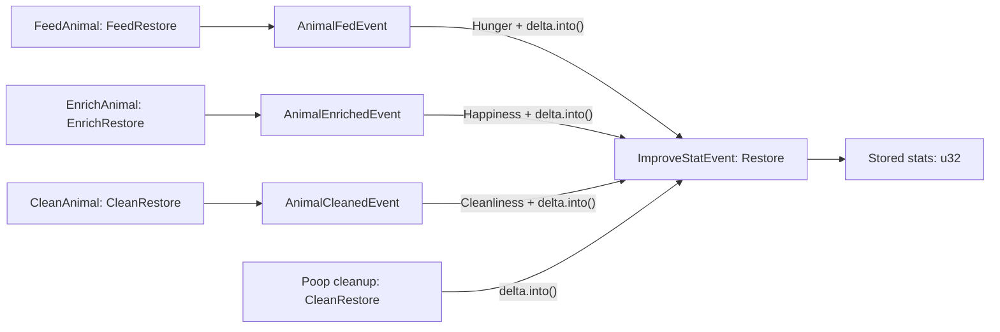

# Care restore newtypes and semantic care-action split

## Scope lock

Execute this plan only on `feature/epic-1`.

```bash
git branch --show-current
```

The command must print `feature/epic-1`. If it does not, stop. Do not switch
branches while unrelated working-tree changes are present; report them first.

This branch contains the Epic 1 care framework (`FeedAnimal`, `EnrichAnimal`,
satchel, care feedback) but not Epic 2's Polly nesting content. Do not add new
rooms, nesting tiles, nutrition-house gameplay, or Epic 2 tests/scripts here.

## Goal

Make positive care restores strongly typed from authored interaction through the
shared stat sink, and make each care action restore exactly one stat:

| Action | Input amount | Stat restored |
|---|---|---|
| Feed | `FeedRestore` | `AnimalStat::Hunger` |
| Enrich | `EnrichRestore` | `AnimalStat::Happiness` |
| Clean | `CleanRestore` | `AnimalStat::Cleanliness` |
| Shared stat sink / debug command | `Restore` | Selected by `StatTarget` |

The action-specific component and event types must not contain an `AnimalStat`
field. This makes invalid combinations such as “feed cleanliness” or “enrich
hunger” unrepresentable and prevents `EnrichAnimal` from remaining an alternate
cleaning path.

Stored stats, stat decay, and `WorsenStatEvent.amount` remain `u32`.

## Resulting pipeline



## 1. Define restore types

Add `crates/alveus-types/src/restore.rs` and export its types from
`crates/alveus-types/src/lib.rs`.

```rust
use bevy_reflect::Reflect;

/// Generic positive restore accepted by the shared stat-improvement sink.
#[derive(Debug, Clone, Copy, PartialEq, Eq, Hash, Reflect)]
#[type_path = "alveus_types"]
pub struct Restore(pub u32);

/// Hunger restored by a feed action.
#[derive(Debug, Clone, Copy, PartialEq, Eq, Hash, Reflect)]
#[type_path = "alveus_types"]
pub struct FeedRestore(pub u32);

/// Happiness restored by an enrichment action.
#[derive(Debug, Clone, Copy, PartialEq, Eq, Hash, Reflect)]
#[type_path = "alveus_types"]
pub struct EnrichRestore(pub u32);

/// Enclosure cleanliness restored by a cleaning action.
#[derive(Debug, Clone, Copy, PartialEq, Eq, Hash, Reflect)]
#[type_path = "alveus_types"]
pub struct CleanRestore(pub u32);

impl From<FeedRestore> for Restore {
    fn from(value: FeedRestore) -> Self { Self(value.0) }
}

impl From<EnrichRestore> for Restore {
    fn from(value: EnrichRestore) -> Self { Self(value.0) }
}

impl From<CleanRestore> for Restore {
    fn from(value: CleanRestore) -> Self { Self(value.0) }
}

impl From<Restore> for u32 {
    fn from(value: Restore) -> Self { value.0 }
}
```

Do not implement cross-action conversions such as `From<FeedRestore> for
EnrichRestore`, or blanket conversions from `u32` into action-specific types.
Constructors at configuration and test boundaries should remain explicit.

Small `const fn get(self) -> u32` accessors are allowed if they make assertions
or logging clearer, but are not required.

## 2. Type all shipped restore configuration

In `crates/alveus-configs/src/lib.rs`:

```rust
pub const CARE_FEED_RESTORE: FeedRestore = FeedRestore(STAT_FULL);
pub const CARE_ENRICH_RESTORE: EnrichRestore = EnrichRestore(STAT_FULL);
pub const CARE_CLEAN_RESTORE: CleanRestore = CleanRestore(STAT_FULL);
```

Delete `care_restore_delta`; its boolean erases the action distinction.

Retype the cleaning configuration:

```rust
pub struct PoopConfig {
    // existing fields...
    pub cleanliness_restore_per_poop: CleanRestore,
}

// shipped value
cleanliness_restore_per_poop: CleanRestore(350),
```

Update fixtures to construct `CleanRestore(...)` explicitly.

There is no generated `PoopConfig` source to update in
`crates/alveus-configs/build.rs`; that build script is currently an empty
placeholder and is out of scope.

Update `crates/alveus-configs/README.md`:

- list the four restore newtypes and typed `CARE_*_RESTORE` constants;
- remove `care_restore_delta`;
- document that Tiled `delta` fields use the matching newtype class shape;
- include `CleanAnimal.delta` beside feed and enrich.

## 3. Retype the shared improvement sink

In `crates/alveus-stats/src/lib.rs`, change only the positive sink:

```rust
pub struct ImproveStatEvent {
    pub target: StatTarget,
    pub amount: Restore,
}
```

At the start of `improve_stat_observer`, convert once:

```rust
let amount = u32::from(event.amount);
```

Use that local for logging and every `saturating_add`. Keep
`WorsenStatEvent.amount` and all decay calculations as `u32`.

Update every `ImproveStatEvent` constructor, including debug helper systems and
tests, to use `Restore(...)` or an action-specific `.into()`.

## 4. Make the headless command wire explicit

In `crates/alveus-headless/src/command.rs`:

```rust
ImproveStat {
    target: StatTarget,
    amount: Restore,
},
```

The dispatcher continues passing `amount` directly into `ImproveStatEvent`.
Update the variant documentation to state that `Restore` is a reflected
one-field tuple struct. Update `Interact` documentation to include
`CleanAnimal`.

The expected JSON representation must be confirmed by a BRP test rather than
guessed. For the derived tuple-struct representation it is expected to be:

```json
{
  "ImproveStat": {
    "target": {
      "Animal": {
        "id": "PushPop",
        "stat": "Hunger"
      }
    },
    "amount": { "0": 250 }
  }
}
```

Use the exact representation accepted by `world.trigger_event` in the test and
in any affected scripts. Do not add a custom BRP method or a second wire-only
command type.

## 5. Split feed, enrich, and clean semantics

In `crates/alveus-interaction/src/lib.rs`, change the components to:

```rust
#[derive(Component, Debug, Clone, Reflect)]
#[reflect(Component)]
#[require(Interactable)]
pub struct FeedAnimal {
    pub animal_id: AnimalId,
    pub required_item: ItemId,
    pub delta: FeedRestore,
    pub prompt: String,
}

#[derive(Component, Debug, Clone, Reflect)]
#[reflect(Component)]
#[require(Interactable)]
pub struct EnrichAnimal {
    pub animal_id: AnimalId,
    pub required_item: Option<ItemId>,
    pub delta: EnrichRestore,
    pub prompt: String,
}

#[derive(Component, Debug, Clone, Reflect)]
#[reflect(Component)]
#[require(Interactable)]
pub struct CleanAnimal {
    pub animal_id: AnimalId,
    pub required_item: Option<ItemId>,
    pub delta: CleanRestore,
    pub prompt: String,
}
```

Remove `stat` from all three action components. Add events with the same strong
typing and no `stat` field:

```rust
#[derive(Event, Debug, Clone, Copy, Reflect)]
#[reflect(Event)]
pub struct AnimalFedEvent {
    pub animal_id: AnimalId,
    pub required_item: ItemId,
    pub delta: FeedRestore,
    pub dish_position: TilePosition,
}

#[derive(Event, Debug, Clone, Copy, Reflect)]
#[reflect(Event)]
pub struct AnimalEnrichedEvent {
    pub animal_id: AnimalId,
    pub required_item: Option<ItemId>,
    pub delta: EnrichRestore,
    pub station_position: TilePosition,
}

#[derive(Event, Debug, Clone, Copy, Reflect)]
#[reflect(Event)]
pub struct AnimalCleanedEvent {
    pub animal_id: AnimalId,
    pub required_item: Option<ItemId>,
    pub delta: CleanRestore,
    pub station_position: TilePosition,
}
```

In `perform_interact_in_world`, retain the existing item validation and event
triggering behavior, then add a `CleanAnimal` branch parallel to enrich. Do not
factor the branches through an erased generic delta or boolean action selector.

The observers must hardcode the only valid stat for their action:

```rust
// apply_animal_fed
StatTarget::Animal {
    id: event.animal_id,
    stat: AnimalStat::Hunger,
}

// apply_animal_enriched
StatTarget::Animal {
    id: event.animal_id,
    stat: AnimalStat::Happiness,
}

// apply_animal_cleaned
StatTarget::Animal {
    id: event.animal_id,
    stat: AnimalStat::Cleanliness,
}
```

Each observer sends `amount: event.delta.into()` and calls
`care_outcome_message` with its hardcoded stat. Cleaning therefore produces
“Cleaned” feedback without traveling through `AnimalEnrichedEvent`.

Register `CleanAnimal` and `AnimalCleanedEvent` in `InteractionPlugin`, and add
`apply_animal_cleaned` as an observer. Update the module documentation.

## 6. Update cleaning and HUD paths

In `crates/alveus-cleaning/src/lib.rs`, convert the configured cleanup restore at
the shared sink:

```rust
amount: config.cleanliness_restore_per_poop.into(),
```

In `crates/alveus-hud/src/lib.rs`, import `CleanAnimal` and display its prompt in
the same interaction-prompt selection used for feed and enrich.

## 7. Migrate Tiled authoring deliberately

### Why the existing scalar cannot remain

`bevy_ecs_tiled` 0.13 deserializes `PV::IntValue` only when the registered field
type path is a primitive integer (`u32`, `i32`, and so on). A `FeedRestore`
tuple struct is deserialized only from a Tiled `ClassValue`. This dispatch occurs
before `FromReflect::take_from_reflect`, so a custom `FromReflect` implementation
cannot convert the existing scalar `int` into the newtype.

Do not add speculative manual `Reflect`, `PartialReflect`, or `FromReflect`
implementations. Migrate the authored field shape instead.

### Required authored shape

Change existing feed properties in `assets/maps/interiors/interiors.tsx` from:

```xml
<property name="delta" type="int" value="1000"/>
```

to the generated class shape for the reflected tuple struct, expected to be:

```xml
<property name="delta" type="class" propertytype="alveus_types::FeedRestore">
  <properties>
    <property name="0" type="int" value="1000"/>
  </properties>
</property>
```

Use the exact member spelling emitted by `cargo run --bin gen_tiled_types`.
This is a structural migration of the existing Epic 1 feed tile, not new map
content.

Update `tools/gen_interiors.py` so its feed helper emits this shape. Add matching
helpers for enrichment and cleaning newtypes so future generated content cannot
reintroduce scalar deltas. Do not add any Epic 2 tile instances.

Run:

```bash
cargo run --bin gen_tiled_types
```

Inspect `assets/maps/overview/tiled_types.json` and verify:

- `FeedAnimal`, `EnrichAnimal`, and `CleanAnimal` have no `stat` member;
- each `delta` member names its matching restore newtype;
- `CleanAnimal` is exported;
- the four restore newtypes are present with the expected one-field shape.

Add or extend an asset-loading integration test using `tests/common::tiled_app`
and `load_tiled_map` to load `maps/interiors/push_pop_enclosure_interior.tmx`.
Assert that the loaded asset succeeds with the migrated TSX dependency and, if
the test harness exposes hydrated tile properties, assert that the feeding dish
contains `FeedRestore(1000)`. At minimum, the test must fail on a property
deserialization error rather than merely checking generated JSON.

## 8. Define registration ownership

Register types in each place for a specific consumer:

| Location | Purpose |
|---|---|
| `InteractionPlugin` | Normal gameplay apps using the interaction plugin |
| `register_headless_types` | BRP schema/query/event access and `gen_tiled_types` exporter |
| `tests/common::tiled_app` | Asset-only Tiled loading tests that do not install gameplay plugins |

`register_headless_types` must register `Restore`, `FeedRestore`,
`EnrichRestore`, `CleanRestore`, `CleanAnimal`, and `AnimalCleanedEvent`, along
with the existing care types. `tests/common::tiled_app` needs the three
action-specific restore types and `CleanAnimal`; it does not need unrelated
events unless a test inspects their schema.

Avoid additional duplicate registration sites without a concrete consumer.

## 9. Tests

### Unit and integration tests

Update:

- `tests/stats_tests.rs`: wrap positive amounts in `Restore(...)`; keep worsening
  amounts unchanged.
- `tests/command_tests.rs`: use `Restore(...)` for `GameCommand::ImproveStat`.
- `tests/care_interaction_tests.rs`: use typed deltas; replace the cleanliness
  enrichment case with `AnimalCleanedEvent`; assert feed affects only hunger,
  enrich only happiness, and clean only enclosure cleanliness.
- `tests/push_pop_flow_test.rs`: remove `stat` from feed component/event fixtures
  and use `FeedRestore` or `CARE_FEED_RESTORE`.
- `tests/cleaning_tests.rs` and `tests/cleaning_brp_tests.rs`: use
  `CleanRestore(...)` in configurations and compare typed values explicitly.
- reflection/registry tests: assert the new action, event, and restore types are
  registered where relevant.

Compare stored stats with `.0` or `u32::from(Restore::from(...))`; stored stat
fields intentionally remain `u32`.

Add negative semantic assertions where useful: after feed, happiness and
cleanliness are unchanged; after enrich, hunger and cleanliness are unchanged;
after clean, hunger and happiness are unchanged.

### BRP wire test

In `tests/brp_tests.rs`, add an end-to-end `world.trigger_event` test for
`GameCommand::ImproveStat` using the exact reflected JSON shape. It must:

1. lower a known stat;
2. send the command through `BrpSender`;
3. receive a successful BRP response;
4. update the app as required by buffered command application;
5. assert the stat increased by the requested amount.

Also send the old bare-scalar `amount` form and assert that BRP returns an error.
This locks the intentional wire-format change. If `registry.schema` is already
covered by a reusable BRP helper, assert that the schema identifies `Restore` as
the amount type; otherwise the successful and rejected wire tests are enough.

## 10. Final audit and verification

The “no bare restore amount” rule applies to positive care-action inputs,
positive restore events/commands, and shipped positive restore configuration.
It does not apply to stored stat values, decay, or `WorsenStatEvent`.

Run a focused source audit and inspect every match:

```bash
rg -n "delta: u32|ImproveStatEvent|cleanliness_restore_per_poop|care_restore_delta|AnimalEnrichedEvent|AnimalStat::Cleanliness" crates tests scripts
```

The audit should establish:

- no care action component/event has `delta: u32`;
- every `ImproveStatEvent.amount` is `Restore` or `.into()` from a specific
  restore type;
- `care_restore_delta` is gone;
- no cleaning path uses `AnimalEnrichedEvent`;
- `WorsenStatEvent.amount` remains `u32`.

Then run:

```bash
cargo fmt --check
cargo build --features headless
cargo test --profile ci
cargo test --features headless --profile ci
cargo clippy --all-targets --features headless -- -D warnings
```

The build output must contain no newly introduced warnings. If clippy or another
check has a pre-existing failure, record the exact failure and demonstrate that
it is unrelated; do not silently weaken or skip the check.

No Python driver is required for this type/semantic migration if the Rust map
load and BRP tests cover it. If a live headless smoke is performed, drive it from
one script under `scripts/`, query state after actions, save screenshots under
`screenshots/` only if visual verification is useful, and stop the server at the
end:

```bash
pgrep -af alveus-idle-cli
```

There must be no server left autosaving `save.ron`.

## Definition of done

- [ ] Work was performed on `feature/epic-1` with unrelated changes preserved.
- [ ] Four restore newtypes exist and only action-specific-to-`Restore`
      conversions are provided.
- [ ] Feed, enrich, and clean components/events have typed deltas and no `stat`
      field.
- [ ] Feed always restores hunger, enrich always restores happiness, and clean
      always restores enclosure cleanliness.
- [ ] `ImproveStatEvent` and `GameCommand::ImproveStat` use `Restore`.
- [ ] Restore constants and `PoopConfig` use their action-specific types;
      `care_restore_delta` is deleted.
- [ ] Existing Tiled feed content uses the newtype class shape, generators emit
      it, and a real map-load test passes.
- [ ] `tiled_types.json` is regenerated and contains the expected schemas.
- [ ] BRP tests lock both the accepted new `Restore` JSON shape and rejection of
      the old scalar shape.
- [ ] Registry additions exist only where required by gameplay, headless/export,
      or asset-only tests.
- [ ] Both cargo test profiles pass, formatting is clean, and no new build or
      clippy warnings were introduced.
- [ ] The final source audit finds no positive care restore left as a bare
      `u32`, while worsening/decay and stored stats remain unchanged.
- [ ] No stray headless process remains.

## Out of scope

- Polly nesting or any other Epic 2 map/content work.
- Nutrition House flow tests or Polly driver scripts.
- Changing stored `AnimalStats` / `EnclosureStats` fields to newtypes.
- Changing `WorsenStatEvent`, decay amounts, or decay configuration to restore
  types.
- New `GameCommand` variants, pathfinding, key injection, custom BRP methods, or
  bespoke observation resources.
